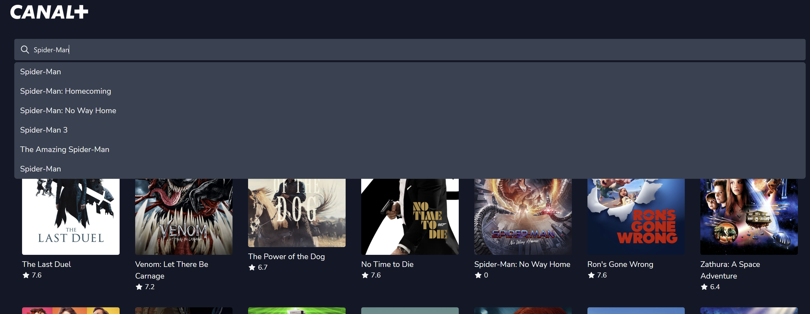

# Movies Browser

A movies browser built using NextJS, TailwindCSS and TypeScript. The website is powered by the TMDB API.

# Technologies Used

- [Next.js](https://nextjs.org/): An open-source React front-end development web framework that enables functionality such as server-side rendering and generating static websites for React based web applications.
- [TailwindCSS](https://tailwindcss.com):  A utility-first CSS framework packed with classes that can be composed to build any design, directly in your markup.
- [TypeScript](https://www.typescriptlang.org/): It is a strict syntactical superset of JavaScript and adds optional static typing to the language.
- [TMDB API](https://developers.themoviedb.org/3/): The TMDb API is a resource for developers to integrate movie, TV show and cast data along with posters or movie fan art.

# Usage

- Clone the repo:  `git clone https://github.com/falcononrails/canalplus-movies-browser.git`
- Install all dependencies: `yarn install`
- Create a `.env.local` file and put your TMDB API key in it (check .env.example for the format).
- Run the app locally: `yarn run dev`
- Your can run the test suite using:  `yarn run test`

# Home

The home page displays trending movies and tv shows in a grid-display. The user can see the title and the rating of each movie/tv show, or click on a poster to see more details.

# Search

The coolest feature of the app is the ability to search for movies/tv shows.

# Details

When a user clicks on a poster through the home page, or through the search bar, he is redirected to the corresponding details page of the movie/tv show. The user can check the movie's/tv show's rating, description, genres and a custom quote.

